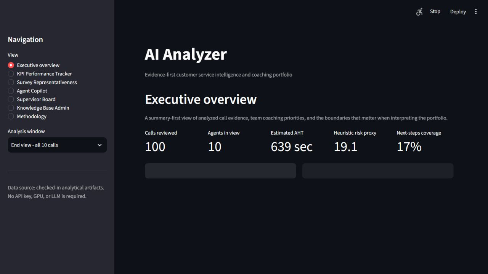
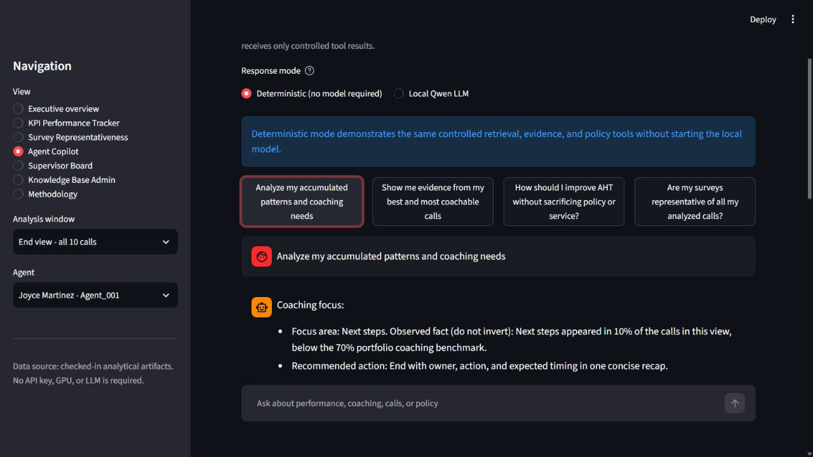
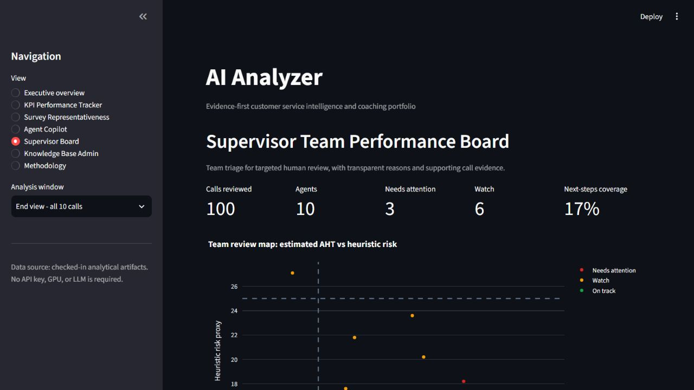

# AI Call center Analyzer


An evidence-first call-center analytics project: pretrained speech,
text, and acoustic models turn calls into explainable coaching signals for
agents and supervisors—without presenting a heuristic as an employee score.

## Overview

**Business problem.** Supervisors cannot listen to every call, feedback arrives
late, and one-size-fits-all coaching encourages micromanagement. Agents also
need a simple way to understand which KPI deserves attention during a shift.

**System.** An end-to-end analytical workflow covering 100 calls, 10 agents,
and 11,056 fused turns. It combines Faster Whisper,
channel-based speaker assignment, Hugging Face sentiment, rule-based service
behaviors, acoustic features, versioned fusion, an agent KPI tracker, and a
supervisor review board. The optional local Qwen copilots explain only facts
retrieved by controlled tools; they never calculate KPI truth. The bounded
Supervisor Copilot can plan up to four read-only team or agent evidence tools.
Its Phase 6 tool also surfaces anonymous recurring techniques only within
matched dataset-derived contexts.

**Evidence boundaries.** The system separates observed/model
signals, derived proxies, synthetic UI fixtures, and real outcomes. Agent
ordering by mean risk is descriptive, unadjusted for call mix, and **not
suitable for employment decisions**. The system prioritizes evidence for human
review; it does not authorize discipline, compensation, or termination.

**Validated scope.** All 100 calls reconcile to metadata, 90 automated
tests pass, both dashboards rebuild deterministically, and the analytical
contract has zero blocking issues. The risk rubric is still an uncalibrated
proxy: there are 76 low, 24 medium, and 0 high-risk calls. A score-blinded
30-call human review pilot is included to test construct validity; it has not
been labeled yet.

## See it

- **Primary interactive experience:** Streamlit dashboard with executive,
  agent KPI, synthetic survey representativeness, grounded Agent Copilot with
  accumulated Agent Memory, Supervisor Board, bounded Supervisor Copilot,
  Knowledge Base Admin, and methodology views.
- [Agent KPI Performance Tracker](dashboard/kpi_performance_tracker.html)
- [Supervisor Team Performance Board](dashboard/supervisor_board.html)
- [10-page technical brief](docs/AI_Analyzer_Technical_Design.pdf) —
  architecture, core formulas, evidence, product decisions, and limitations
- [Human risk-validation pilot](docs/risk_proxy_validation_pilot.md)
- [Phase 4 Copilot evaluation](reports/copilot_evaluation_report.md)
- [Phase 6 cross-agent evaluation](reports/cross_agent_learning_evaluation_report.md)
- [Reproducibility guide](docs/REPRODUCIBILITY.md)
- [Project structure and reviewer path](docs/PROJECT_STRUCTURE.md)

### Dashboard preview



| Agent Copilot | Supervisor Board |
| --- | --- |
|  |  |

### Phase 6: anonymous cross-agent learning

<p align="center">
  
</p>

*Conceptual Phase 6 mark. It does not display agent rankings or
validated outcome effects; every production recommendation still requires
governed outcomes and human review.*

The Streamlit app reads the same checked-in analytical artifacts as the
self-contained HTML fallbacks. No API key, GPU, or LLM is required.

### Run the Streamlit dashboard

From the repository root in VS Code PowerShell:

```powershell
.\.venv\Scripts\python.exe -m pip install -r requirements-dashboard.txt
.\.venv\Scripts\python.exe -m streamlit run app/dashboard.py
```

Open the local URL printed by Streamlit, normally `http://localhost:8501`.

Both Copilot views default to deterministic mode so the complete interface can
be reviewed without a model download. To use the installed local Qwen model,
start it in a second VS Code terminal and select **Local Qwen LLM** inside the
Agent Copilot or Supervisor Copilot view:

```powershell
.\scripts\start_local_model.ps1
```

In Supervisor Copilot, Qwen first selects a maximum of four tools from a fixed
read-only catalog and then synthesizes the cited results. If planning,
generation, or a grounding guardrail fails, the view reports the reason and
falls back to the deterministic workflow.

The managed launcher automatically uses the validated Vulkan backend when it
is available: 20 Qwen layers are offloaded to the RTX 3050 while CPU mode
remains available through `-Backend cpu`. The 30-prompt Phase 4 evaluation
selected Qwen for optional post-call explanation, while deterministic mode
remains the zero-resource application default.

Agent Memory, business-scoped knowledge ingestion, and survey
representativeness are documented in `docs/` and available through the same
Streamlit interface.

## Reproduce the project

Reference environment: Windows 10/11, PowerShell 5.1+, Python 3.12.

From a local checkout:

```powershell
cd ai_analyzer_core_v0
.\scripts\setup_demo_environment.ps1
.\scripts\reproduce_portfolio.ps1
```

This lightweight path runs the tests, validates the contract, rebuilds both
dashboard artifacts, verifies provenance and population counts, and writes
`reports/reproducibility_report.{json,md}`. It does not download or start
Whisper, Transformers, Qwen, llama.cpp, or a GPU workload.

## Known limits—read before interpreting the dashboards

- `conversation_risk_v1` is a hand-weighted, uncalibrated review proxy—not
  CSAT, QA, survey probability, or official performance.
- Estimated AHT is recording duration; it excludes hold time, after-call work,
  and telephony-system timing.
- Acoustic intensity is relative within a call and is not an emotion label;
  lexical behavior rules can miss implicit behaviors.
- Demo CSAT, QA, NPS, Five Stars, and the 30 supplied survey rows are explicitly
  synthetic fixtures. Real survey-model training remains blocked.
- Agent comparisons do not adjust for call complexity, language, market, or
  workload.
- Agent Memory v1.1 personalizes recommendations from self-history and
  dataset-derived context, but it contains only sequence-based snapshots with
  at most 10 calls per agent. Every recommendation is labeled low confidence;
  production longitudinal use is blocked by `NO_GOVERNED_DATED_HISTORY`.
- Cross-agent learning exposes 7 low-confidence anonymous technique candidates
  across 4 exact matched contexts. It does not rank agents or validate outcome
  improvement; operational use is blocked by
  `NO_GOVERNED_OUTCOMES_FOR_CROSS_AGENT_LEARNING`.
- The local Qwen Phase 4 evaluation had 11.33-second median and 21.64-second
  p95 latency with partial GPU offload. It is therefore a
  **post-call/end-of-day explanation prototype**, not live in-call assistance.

## Data and license

The sample is derived from AppTek's role-played call-center dialogue benchmark,
not real customer calls. Its dataset card lists **CC BY-SA 4.0** and states that
the release is intended for evaluation and analysis rather than model training
or real-world customer-data applications. This repository should preserve
attribution and source IDs. This repository does not redistribute the original
audio. Review the
[official dataset card](https://huggingface.co/datasets/apptek-com/apptek_callcenter_dialogues)
and [CC BY-SA 4.0 terms](https://creativecommons.org/licenses/by-sa/4.0/)
before publishing a fork.

The source code is available under the [MIT License](LICENSE). Dataset files
and derived analytical artifacts are governed separately; see
[DATA_NOTICE.md](DATA_NOTICE.md) before redistribution.

## Technical documentation

- [Project structure](docs/PROJECT_STRUCTURE.md)
- [Technical brief](docs/AI_Analyzer_Technical_Design.pdf)
- [Analytical contract](docs/analytical_contract.md)
- [Agent Memory](docs/agent_memory.md)
- [Phase 5 personalization evaluation](reports/personalization_evaluation_report.md)
- [Phase 6 cross-agent evaluation](reports/cross_agent_learning_evaluation_report.md)
- [Knowledge ingestion](docs/knowledge_ingestion.md)
- [Roadmap](ROADMAP.md)
