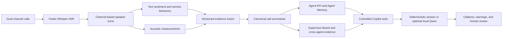

# AI Call Center Analyzer

<p align="center">
  
</p>

An evidence-first customer-service analytics system that transforms
calls into auditable coaching signals for agents and supervisors. It combines
pretrained speech and language models, acoustic analysis, deterministic
contracts, role-specific dashboards, and optional grounded local LLMs—without
presenting a heuristic as an employee score.


## Portfolio snapshot

| Evidence | Validated result |
| --- | --- |
| Analytical population | 100 calls, 10 synthetic portfolio agents |
| Turn-level evidence | 11,056 fused turns |
| Automated verification | 90 tests passing |
| Copilot evaluation | 30/30 fixed prompts passed |
| Phase 5 personalization | 9/9 portfolio gates passed |
| Phase 6 cross-agent learning | 10/10 portfolio gates passed; 7 anonymous candidates across 4 matched contexts |
| Real survey labels | 0; outcome-model training remains blocked |
| Lightweight requirements | CPU only; no API key, GPU, model server, or database server required |

## The problem

Call-center supervisors cannot listen to every interaction. Feedback therefore
arrives late, depends on a small monitored sample, and can become generic or
overly focused on lagging KPIs. Agents need timely, specific guidance, while
supervisors need a way to find useful evidence without turning monitoring into
an opaque ranking system.

The practical challenges are:

- convert long audio interactions into searchable, turn-linked evidence;
- combine what was said with how the conversation sounded;
- distinguish observed signals, analytical proxies, synthetic fixtures, and
  real business outcomes;
- personalize coaching without overreacting to a few calls;
- help supervisors compare similar contexts instead of ranking whole people;
- allow an LLM to explain evidence without letting it invent KPI truth.

## What the system delivers

AI Analyzer supports two connected decision workflows:

### For agents

- KPI Performance Tracker with start, live, and end-of-shift views;
- current value, goal, trend, projection, freshness, source, and recommended
  action for each displayed KPI;
- one focused coaching priority instead of trying to optimize every metric;
- best analyzed and coachable call evidence;
- accumulated Agent Memory with stage-to-stage behavior changes;
- Agent Copilot answers grounded in controlled KPI, call, coaching, policy,
  survey-representativeness, and memory tools.

### For supervisors

- team health and review-priority summaries;
- estimated-AHT-versus-risk context and behavior coverage;
- explainable coaching queue with supporting calls and reason codes;
- best-call and coachable-call examples for human review;
- agent-versus-team context without presenting it as a ranking;
- anonymous cross-agent technique candidates from matched contexts;
- Supervisor Copilot with bounded planning over read-only evidence tools.

## How it works



1. **Transcription.** Faster Whisper converts each audio channel into timestamped
   text segments.
2. **Speaker assignment.** The sample already separates speakers by channel, so
   deterministic channel mapping is used instead of general diarization.
3. **Text analysis.** A pretrained RoBERTa classifier estimates turn-level text
   sentiment. Phrase rules detect explicit frustration, empathy, probing,
   ownership, and next-step language.
4. **Acoustic analysis.** Librosa measures duration, RMS, pitch, and speaking
   rate. Levels are normalized within each call and are not emotion labels.
5. **Evidence fusion.** Text and acoustic records are joined by call and turn.
   Stable reason codes resolve conclusions back to supporting evidence IDs.
6. **Call aggregation.** The pipeline creates one canonical summary per call and
   validates exact metadata coverage before building agent or team views.
7. **Product analytics.** Deterministic builders create the Streamlit-ready
   dashboard, Agent Memory, survey-representativeness, and cross-agent artifacts.
8. **Grounded explanation.** Copilots retrieve those artifacts through controlled
   tools. The optional LLM explains the retrieved packet; it does not calculate
   official KPIs or query arbitrary project data.

## What each model or analytical component does

| Component | Implementation | What it contributes | Important boundary |
| --- | --- | --- | --- |
| Speech recognition | Faster Whisper `small`, CPU `int8` | Timestamped transcript segments for both channels | ASR errors propagate downstream |
| Speaker assignment | Deterministic channel mapping | Normalized agent/customer turns | Valid for this channel-separated sample, not general diarization |
| Text sentiment | `cardiffnlp/twitter-roberta-base-sentiment-latest` | Turn-level textual sentiment signal | Text sentiment is not vocal tone or customer outcome |
| Service behaviors | Versioned phrase and question rules | Frustration, empathy, probing, ownership, and next-step evidence | Can miss implicit or paraphrased behavior |
| Acoustic analysis | Librosa and SoundFile | RMS, pitch, speaking rate, duration, and relative levels | Measurements are not direct emotion labels |
| Conversation risk | Deterministic `conversation_risk_v1` rubric | Prioritizes calls for review with explicit reason codes | Uncalibrated proxy—not QA, CSAT, or a probability |
| Agent Memory | Deterministic cumulative stage analytics | Self-history, behavior changes, selected context, cited focus | Maximum 10 calls per agent; low confidence |
| Cross-agent learning | Exact context matching plus evidence thresholds | Anonymous recurring technique candidates | No rankings, causal effects, or validated outcome improvement |
| Local Copilot | Qwen3-4B Q4_K_M through llama.cpp | Synthesizes retrieved facts into a readable answer | Optional post-call explanation layer; never KPI truth |
| Survey baseline | Guarded logistic-regression workflow | Future interpretable outcome baseline | Training is disabled because no governed real labels exist |

## The agentic LLM layer

The application works completely in deterministic mode. When **Local Qwen
LLM** is selected, the LLM receives only the results of approved read-only tools.

The Agent Copilot can retrieve:

- KPI lookup and daily recap;
- call evidence and coaching context;
- approved portfolio policy chunks;
- survey representativeness;
- accumulated Agent Memory.

The Supervisor Copilot can plan at most four calls from a fixed catalog covering
team metrics, agent-team context, coaching queue, review calls, descriptive
statistics, Agent Memory, policy search, and anonymous cross-agent learning.

Every response carries citations and visible limitations. Unsupported numbers,
inverted behavior claims, or false official-outcome claims reject the model
answer and trigger a deterministic fallback from the same retrieved evidence.

The validated local configuration uses Qwen3-4B Q4_K_M through a localhost-only
llama.cpp server. Partial Vulkan offload can use 20 layers on an RTX 3050, but
CPU mode is supported and the model is not required for the portfolio demo.
Measured Phase 4 latency—11.33-second median and 21.64-second p95—positions it as
a post-call or end-of-day explanation prototype, not live in-call assistance.

## Evidence and governance model

The analytical contract separates four classes that must not be mixed:

| Evidence class | Examples | Permitted interpretation |
| --- | --- | --- |
| Observed/model signal | transcript, text sentiment, pitch, RMS, phrase flag | Bounded analytical evidence with model or rule limitations |
| Derived proxy | estimated AHT, heuristic conversation risk | Review and coaching context only |
| Synthetic fixture | demo CSAT, QA, NPS, Five Stars, supplied survey fixture | Interface, contract, join, and guardrail testing only |
| Real outcome | governed QA or completed linked survey | Reporting or modeling only after readiness and governance gates pass |

Estimated AHT is recording duration and excludes hold time, after-call work, and
telephony timing. `conversation_risk_v1` is hand-weighted and uncalibrated. The
current portfolio distribution is 76 low, 24 medium, and 0 high-risk calls; that
distribution is a validation warning, not evidence that difficult calls do not
exist.

## Product screenshots

The primary interface is one integrated Streamlit application with executive,
agent KPI, survey representativeness, Agent Copilot, Supervisor Board,
Supervisor Copilot, Knowledge Base Admin, and methodology views.

### Executive overview


| Agent Copilot | Supervisor Board |
| --- | --- |
|  |  |

The Phase 6 mark at the top is conceptual. It does not display rankings or
validated outcome effects; production recommendations still require governed
outcomes and human review. The original system illustration is retained as an
unreferenced backup asset under `docs/assets/`.

## Technology stack

| Layer | Tools |
| --- | --- |
| Language and runtime | Python 3.12, PowerShell |
| Data processing | pandas, NumPy, SQLite |
| Speech and NLP | Faster Whisper, PyTorch, Hugging Face Transformers |
| Audio analytics | Librosa, SoundFile, SciPy |
| Product UI | Streamlit, Plotly |
| Local LLM | Qwen3-4B GGUF, llama.cpp, optional Vulkan offload |
| Retrieval and documents | LangChain Core, LangChain Text Splitters, pypdf, docx2txt |
| Outcome research | scikit-learn guarded logistic-regression baseline |
| Quality and reproducibility | `unittest`, versioned JSON contracts, deterministic artifact builders, SHA-256 report |

## Quick start

Reference environment: Windows 10/11, PowerShell 5.1+, Python 3.12.

### Run the Streamlit product

```powershell
python -m venv .venv
.\.venv\Scripts\python.exe -m pip install -r requirements-dashboard.txt
.\.venv\Scripts\python.exe -m streamlit run app/dashboard.py
```

Open the local URL printed by Streamlit, normally `http://localhost:8501`.
Deterministic mode is the default and requires no API key or model download.

### Optional local Qwen

If the checked local model and llama.cpp runtime are available:

```powershell
.\scripts\start_local_model.ps1
```

Then select **Local Qwen LLM** in the Agent Copilot or Supervisor Copilot view.
The local model files and runtime are intentionally excluded from the
lightweight repository package.

### Reproduce and validate

```powershell
.\scripts\setup_demo_environment.ps1
.\scripts\reproduce_portfolio.ps1
```

This path runs the complete test suite, validates the analytical contract,
rebuilds canonical dashboard and personalization artifacts, exercises survey
provenance gates, and writes:

- `reports/reproducibility_report.json`
- `reports/reproducibility_report.md`

It does not start Whisper, Transformers, Qwen, llama.cpp, or a GPU workload.

## Reviewer path

1. Run the Streamlit app or inspect the screenshots above.
2. Open the portable [Agent KPI Performance Tracker](dashboard/kpi_performance_tracker.html).
3. Open the portable [Supervisor Team Performance Board](dashboard/supervisor_board.html).
4. Read the [10-page technical brief](docs/AI_Analyzer_Technical_Design.pdf).
5. Inspect the [analytical contract](config/analytical_contract_v1.json) and
   [automated tests](tests/).
6. Review the [reproducibility report](reports/reproducibility_report.md).

## Repository map

| Path | Purpose |
| --- | --- |
| `app/` | Integrated Streamlit product |
| `src/` | Reusable pipeline, dashboard, Copilot, personalization, outcome, and validation code |
| `config/` | Versioned contracts, thresholds, model settings, and evaluation gates |
| `data/` | Metadata, derived evidence, canonical summaries, outcomes, and validation records |
| `dashboard/` | Checked-in JSON artifacts and portable HTML views |
| `knowledge_base/` | Portfolio policy sources used by controlled retrieval |
| `tests/` | Unit and integration verification |
| `reports/` | Evaluation and reproducibility outputs |
| `docs/` | Technical design, methodology, governance, and runbooks |
| `scripts/` | Setup, reproduction, and optional local-model operations |

## Known limitations

- The source is AppTek's role-played benchmark, not real customer calls.
- ASR, sentiment, phrase rules, and acoustic measurements can all be wrong.
- Agent comparisons do not adjust for approved call complexity, language,
  market, workload, or other production confounders.
- Agent Memory uses sequence-based snapshots with at most 10 calls per agent;
  governed longitudinal use is blocked by `NO_GOVERNED_DATED_HISTORY`.
- Cross-agent learning exposes 7 low-confidence anonymous candidates across 4
  exact matched contexts. Operational use remains blocked by
  `NO_GOVERNED_OUTCOMES_FOR_CROSS_AGENT_LEARNING`.
- Demo business KPIs and the 30 supplied survey rows are synthetic fixtures.
- Real outcome training remains blocked by `NO_REAL_SURVEY_LABELS`.
- The score-blinded 30-call human risk-review pilot has been prepared but not
  labeled, so the risk rubric has no completed construct-validity result.

## Data and license

The sample is derived from AppTek's role-played call-center dialogue benchmark.
Its dataset card lists **CC BY-SA 4.0** and positions the release for evaluation
and analysis rather than model training or real-world customer-data use. This
repository preserves attribution and source IDs and does not redistribute the
original audio. Review the
[official dataset card](https://huggingface.co/datasets/apptek-com/apptek_callcenter_dialogues)
and [CC BY-SA 4.0 terms](https://creativecommons.org/licenses/by-sa/4.0/)
before publishing a fork.

Source code is available under the [MIT License](LICENSE). Dataset files and
derived analytical artifacts are governed separately; see
[DATA_NOTICE.md](DATA_NOTICE.md) before redistribution.

## Detailed documentation

- [Project structure](docs/PROJECT_STRUCTURE.md)
- [Technical brief](docs/AI_Analyzer_Technical_Design.pdf)
- [Analytical contract](docs/analytical_contract.md)
- [Agent Memory](docs/agent_memory.md)
- [Knowledge ingestion](docs/knowledge_ingestion.md)
- [Phase 4 Copilot evaluation](reports/copilot_evaluation_report.md)
- [Phase 5 personalization evaluation](reports/personalization_evaluation_report.md)
- [Phase 6 cross-agent evaluation](reports/cross_agent_learning_evaluation_report.md)
- [Human risk-validation pilot](docs/risk_proxy_validation_pilot.md)
- [Reproducibility guide](docs/REPRODUCIBILITY.md)
- [Roadmap](ROADMAP.md)
